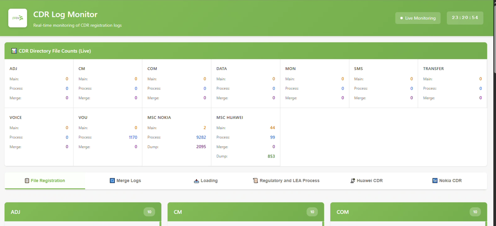
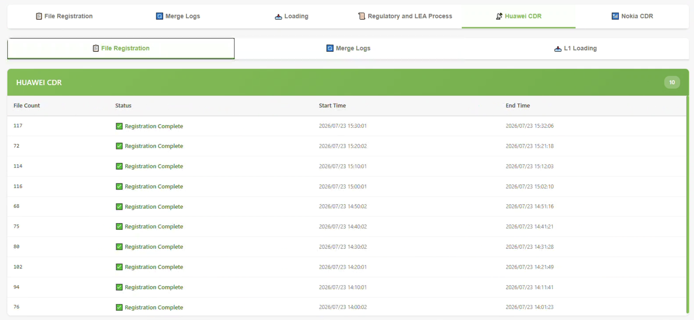
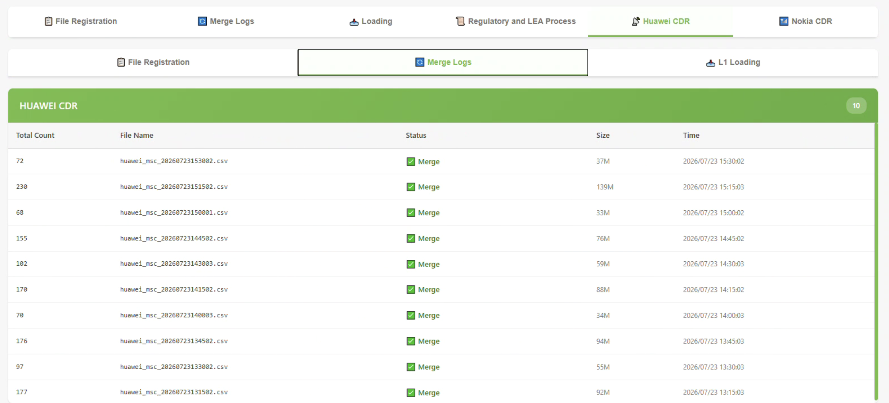
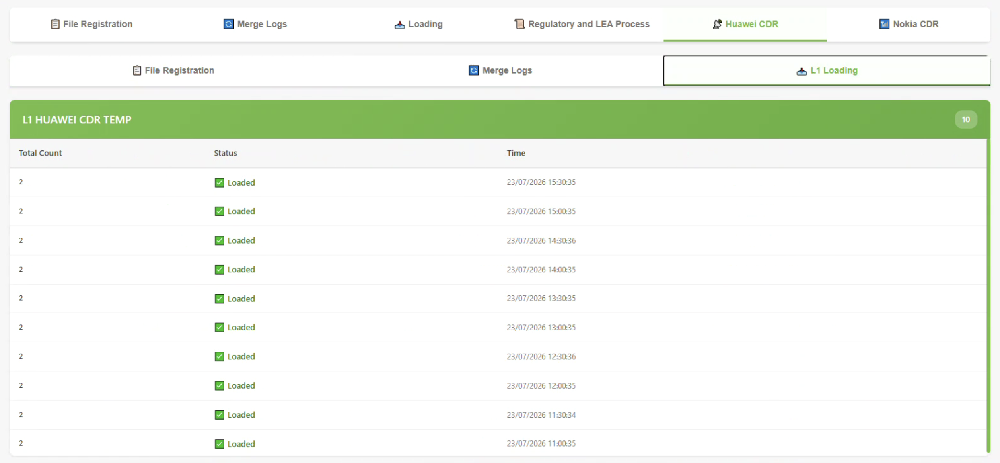
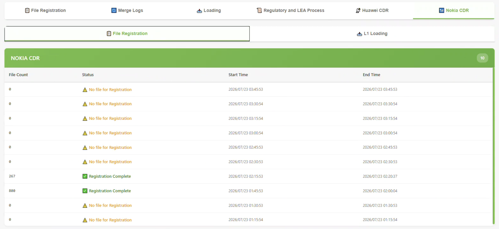
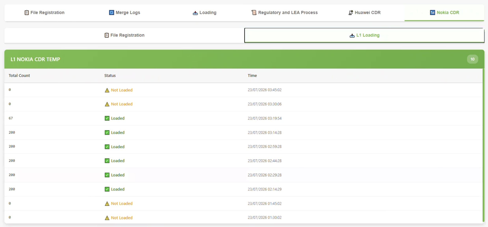
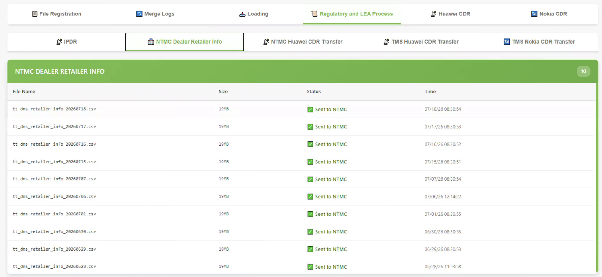
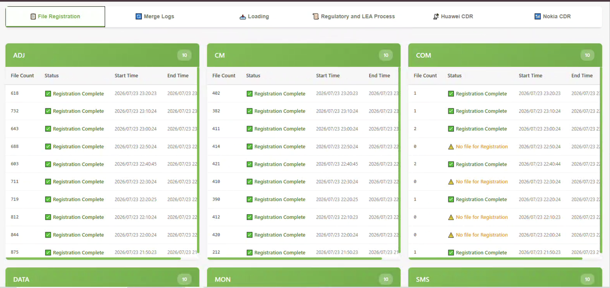

# CDR Log Monitor — Teletalk

Real-time monitoring dashboard for CDR (Call Detail Record) file registration, merging, and loading pipelines across Teletalk's CBS and MSC servers. Built with Flask, paramiko (SSH) and a single-page dashboard UI — no database required, everything is polled live from remote log files.

---

## 📸 Screenshots / UI

||
|---|---|
|||
|||
|||
|||
|||

---

## ✨ Features

- **Live file counts** across CDR directories (main / process / merge / dump) for all categories
- **File Registration** monitoring — tracks pending vs. completed registration per CDR category
- **Merge Logs** — shows merged file counts, sizes, and timestamps per segment
- **L1 Loading** — tracks file loads into staging tables
- **Regulatory & LEA tab** — IPDR transfers, NTMC Dealer/Retailer info, NTMC & TMS Huawei/Nokia CDR transfers
- **Huawei CDR** and **Nokia CDR** tabs — dedicated views pulling from the MSC server (204)
- Auto-refreshing UI (every 5 minutes) with a live clock
- Background threads poll each data source independently so one slow/broken source never blocks the rest

---

## 🖥️ Servers Monitored

| Server | IP | Role |
|---|---|---|
| CBS CDR Server | `192.168.61.202` | File registration, merge, L1 loading, IPDR |
| MSC CDR Server | `192.168.61.204` | Huawei/Nokia MSC registration, merge, L1 loading |
| Regulatory Server | `192.168.61.253` | NTMC Dealer info, NTMC/TMS Huawei & Nokia CDR transfer logs |

All connections use SSH (`paramiko`) with credentials defined in `SERVER_CONFIG`, `SERVER_CONFIG_204`, and `SERVER_CONFIG_253`.

---

## 🗂️ Dashboard Tabs

1. **File Registration** — per-category (voice, data, sms, mon, com, cm, transfer, vou, adj) registration status
2. **Merge Logs** — merged file batches with size and timestamp
3. **Loading** — L1 staging load status per category
4. **Regulatory and LEA Process** (sub-tabs):
   - IPDR
   - NTMC Dealer Retailer Info
   - NTMC Huawei CDR Transfer
   - TMS Huawei CDR Transfer
   - TMS Nokia CDR Transfer
5. **Huawei CDR** (sub-tabs): File Registration | Merge Logs | L1 Loading
6. **Nokia CDR** (sub-tabs): File Registration | L1 Loading

---

## 🔌 API Endpoints

| Endpoint | Description |
|---|---|
| `GET /api/file-counts` | CBS directory file counts (202) |
| `GET /api/merge-logs` | CBS merge logs (202) |
| `GET /api/registration-logs` | CBS registration logs (202) |
| `GET /api/ipdr-logs` | IPDR transfer logs |
| `GET /api/l1-loading-logs` | CBS L1 loading logs (202) |
| `GET /api/204/registration-logs` | MSC registration logs (Huawei/Nokia) |
| `GET /api/204/merge-logs` | MSC merge logs (Huawei) |
| `GET /api/204/l1-loading-logs` | MSC L1 loading logs (Huawei/Nokia) |
| `GET /api/204/file-counts` | MSC directory file counts |
| `GET /api/253/ntmc-dealer-logs` | NTMC Dealer/Retailer transfer logs |
| `GET /api/253/ntmc-hw-cdr-logs` | NTMC Huawei CDR transfer logs |
| `GET /api/253/tms-hw-cdr-logs` | TMS Huawei CDR transfer logs |
| `GET /api/253/tms-nk-cdr-logs` | TMS Nokia CDR transfer logs |

---

## ⚙️ Tech Stack

- **Backend:** Python, Flask, paramiko (SSH log tailing)
- **Concurrency:** Python `threading` — one background poller per data source, each with its own lock
- **Frontend:** Vanilla HTML/CSS/JS (single-file template, no build step), auto-refresh via `fetch` + `setInterval`
- **Data source:** No database — reads directly from remote log files (`tail -n`) and directory listings (`ls | wc -l`) over SSH

---

## 🔄 How It Works

1. On startup, one background thread per data source (registration, merge, IPDR, L1 loading, MSC-side, and the three 253 sources) starts polling every **5 minutes**.
2. Each thread opens an SSH connection, tails the relevant log file(s) or counts files in a directory, parses the output with regex, and stores the last **10 entries** in a thread-safe in-memory store.
3. The frontend polls the Flask API endpoints every 5 minutes and re-renders the relevant tab/card.
4. A live clock updates every second independently of data refresh.

---
